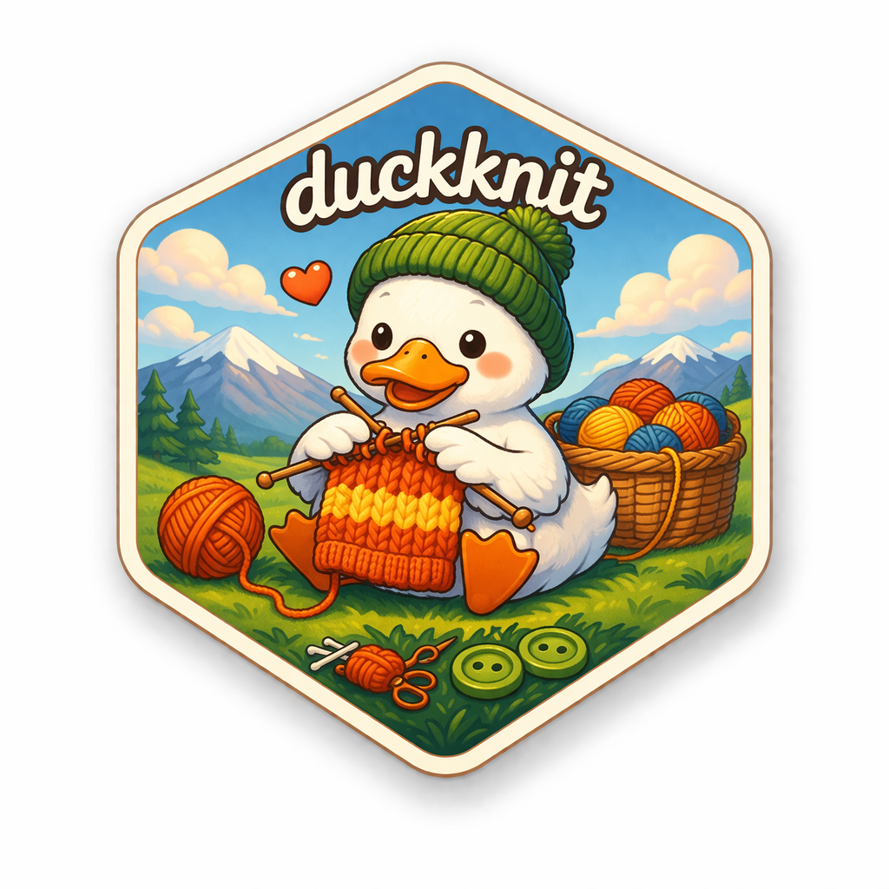

<!-- README.md is generated from README.qmd. Please edit that file -->

```{r}
#| include: false
knitr::opts_chunk$set(
  collapse = TRUE,
  comment = "#>",
  fig.path = "man/figures/README",
  out.width = "100%",
  echo = "fenced"
)

options(width = 80)
```

```{r}
#| include: false
library(duckknit)
```

# duckknit 

<!-- badges: start -->
[](https://github.com/rundel/duckknit/actions/workflows/R-CMD-check.yaml)
<!-- badges: end -->

duckknit provides a [knitr](https://yihui.org/knitr/) chunk engine that interfaces with the [DuckDB](https://duckdb.org/) command-line interface. It allows you to write `{duckdb}` code chunks in R Markdown and Quarto documents that execute SQL against DuckDB databases, with persistent sessions that carry state across chunks.

## Prerequisites

The DuckDB CLI must be installed and available on your `PATH`. See the [DuckDB installation guide](https://duckdb.org/docs/installation/) for instructions.

You can verify your installation with:

```{r}
#| echo: true
duckdb_sitrep()
```

## Installation

You can install the development version of duckknit from GitHub with:

``` r
# install.packages("pak")
pak::pak("rundel/duckknit")
```

## Usage

Load the package to register the `duckdb` knitr engine:

```r
library(duckknit)
```

Then use `{duckdb}` chunks in your document. By default, chunks use an in-memory database and each chunk reuses the last active session, so state persists automatically:

```{duckdb}
CREATE TABLE penguins (species TEXT, island TEXT, bill_length DOUBLE);
INSERT INTO penguins VALUES
  ('Adelie',    'Torgersen', 39.1),
  ('Gentoo',    'Biscoe',    47.3),
  ('Chinstrap', 'Dream',     46.5);
```

```{duckdb}
SELECT * FROM penguins ORDER BY bill_length DESC;
```

### Database files

Use the `db` chunk option to target a specific database file. A new session is created automatically and subsequent chunks without options continue using it:

```{duckdb}
#| db: my.duckdb
CREATE TABLE scores (name TEXT, score INT);
INSERT INTO scores VALUES ('Alice', 95), ('Bob', 87);
```

```{duckdb}
.tables
```

```{duckdb}
SELECT * FROM scores;
```


### Output modes

Use the `mode` chunk option or the `.mode` dot-command to control output formatting. Mode changes made with `.mode` persist for the remainder of the session:

```{duckdb}
#| mode: csv
SELECT * FROM scores;
```

```{duckdb}
.mode markdown
SELECT * FROM scores;
```

### Named sessions

The `session` option lets you give a session an explicit name. This is useful for switching between sessions or creating independent workspaces:

```{duckdb}
#| session: analysis
SELECT 42 as answer;
```

```{duckdb}
#| session: analysis
SELECT 'still here' as status;
```

### Managing sessions

Use `duckdb_sitrep()` to see active sessions. The `*` marks the last used session:

```{r}
duckdb_sitrep()
```

Use `duckknit_list_sessions()` to get a tibble of sessions:

```{r}
#| echo: true
duckknit_list_sessions()
```

You can also kill individual sessions or all sessions at once:

```r
duckknit_kill_session("analysis")
duckknit_kill_all_sessions()
```

## Chunk options

| Option    | Default       | Description                              |
|-----------|---------------|------------------------------------------|
| `db`      | `":memory:"`  | Path to a DuckDB database file           |
| `session` | *(auto)*      | Session name — reuses if it exists, creates if new. When omitted, the last used session is reused. |
| `mode`    | *(not set)*   | DuckDB output mode (`csv`, `markdown`, `json`, etc.) |
| `timeout` | `30000`       | Max milliseconds to wait for output      |

Standard knitr options (`echo`, `eval`, `results`, `include`, `error`) are also supported.

## Configuration

If the `duckdb` binary is not on your `PATH`, you can specify its location:

```r
options(duckknit.duckdb = "/path/to/duckdb")
```

## Disclaimer

This project was vibe coded in an afternoon using [Claude Code](https://claude.ai/code). The hex logo was generated via ChatGPT.

```{r}
#| include: false
duckknit_kill_all_sessions()
unlink("my.duckdb")
```
